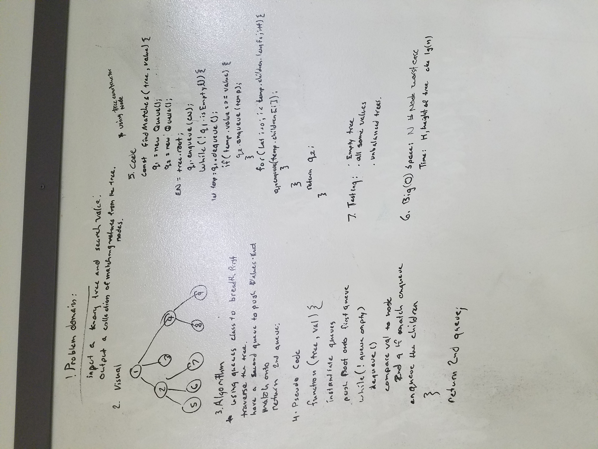

# FindMatches 28
Implementing a queue to help with both traversing and then storing the values that are the same as the targeted value from the parameters passed in. 

## Challenge
    Write a function that takes a k-ary tree with non-unique values and a target value.
    Return a collection of all the nodes from within the tree that match the provided value.
    Avoid utilizing any of the built-in methods available to your language.

## Solution
