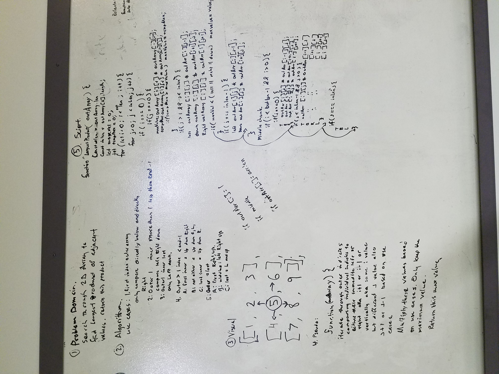

# Largest Product Array 

## Challenge 

Write a function that has an input of a 2-D array, which evaluates to find the product of adjacent values (initially excluding diagonal values), returning the maximum of calculated values.

## Solution

