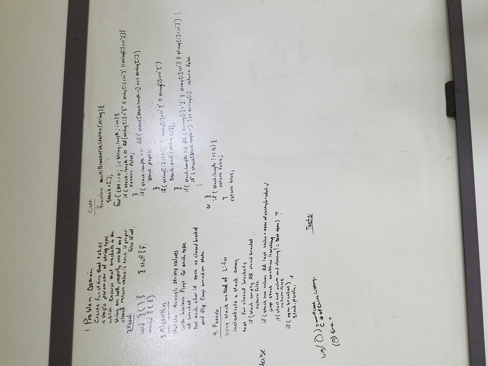

# Multi_Bracket_Validation
There is a single return flag for this whiteboarding problem either true if all of the of the nested brackets are closed in order of occurance or false if does not meet the true case. This problem is based on the stack class concept. 

## Challenge
   Your function should take a string as its only argument, and should return a boolean representing whether or not the brackets in the string are balanced. There are 3 types of brackets:

    Round Brackets : ()
    Square Brackets : []
    Curly Brackets : {}

## Solution
