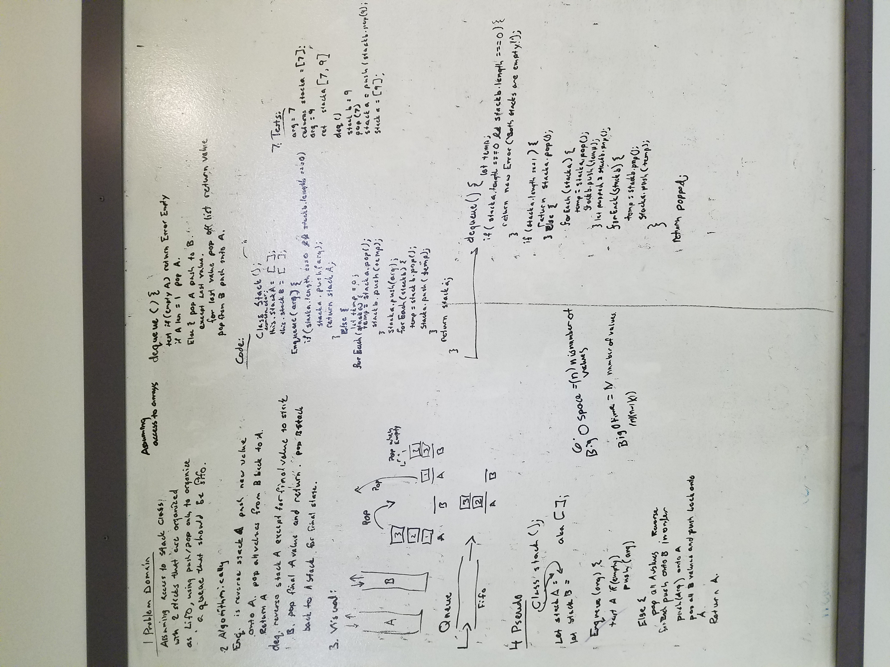

# Queue with Stacks
There are two returns for this whiteboarding problem. The enqueue method returns the entire stack in FIFO order and dequeue returns the value being popped from the 'head' of the FIFO queue. Implementation of the 2 stacks will be using arrays as the data structures. 

## Challenge
Implement the following methods for the Queue class:

    enqueue(value) which inserts value into the Queue using a first-in, first-out approach.
    dequeue() which extracts a value from the Queue using a first-in, first-out approach.

You have access to 2 Stack instances with push and pop methods.

## Solution
