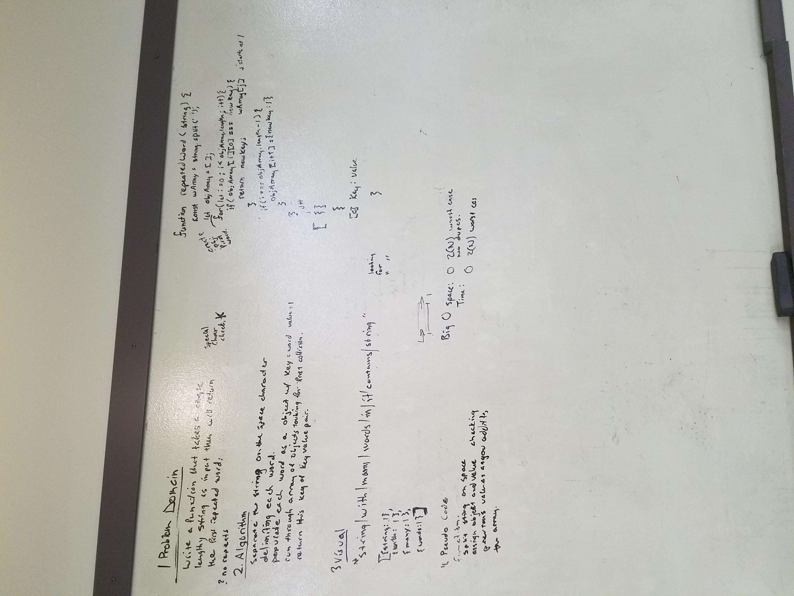

# Repeated Word Finder
This coding challenge is designed to take a string as an input and return the first instance of the first repeated word. 

## Challenge
Write a function that accepts a lengthy string parameter.
Without utilizing any of the built-in library methods available to your language, return the first word to occur more than once in that provided string.

## Solution
